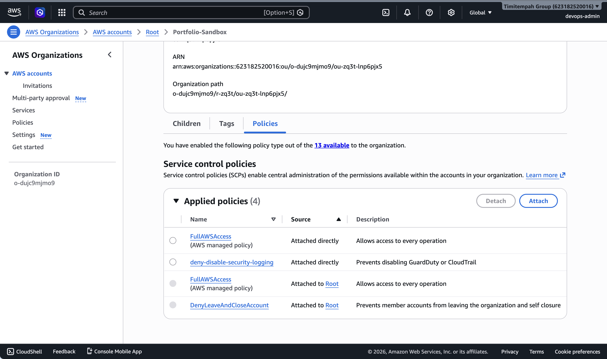

# Task 1 — Landing Zone Foundations

**Handbook Reference:** Chapter 11 — Security & Governance

## What This Task Covers

A Service Control Policy (SCP) is a governance control that sits above IAM in AWS's
permission model. Unlike a normal IAM policy, an SCP isn't something an account's own
administrators can override — it sets a ceiling on what's possible at all within any
account or OU it's attached to, regardless of what permissions an individual user or
role has been granted locally.

## What This Policy Does

`deny-disable-security-logging` is attached to the `Portfolio-Sandbox` OU and explicitly
denies any attempt to disable, stop, or delete GuardDuty or CloudTrail — the two services
responsible for threat detection and audit logging. This means even a user with
`AdministratorAccess` inside an account under this OU cannot turn off security logging,
because the explicit Deny at the SCP layer overrides any Allow granted within the account.

## Evidence

The screenshot below confirms the policy is attached directly to `Portfolio-Sandbox`,
alongside the default `FullAWSAccess` policy every OU starts with.

## Why This Matters

In a real client engagement, this is the first control put in place before any workloads
are deployed — it guarantees that no matter who gets access to an account later, or what
permissions they're mistakenly granted, the organisation's core security visibility can
never be silently switched off.
