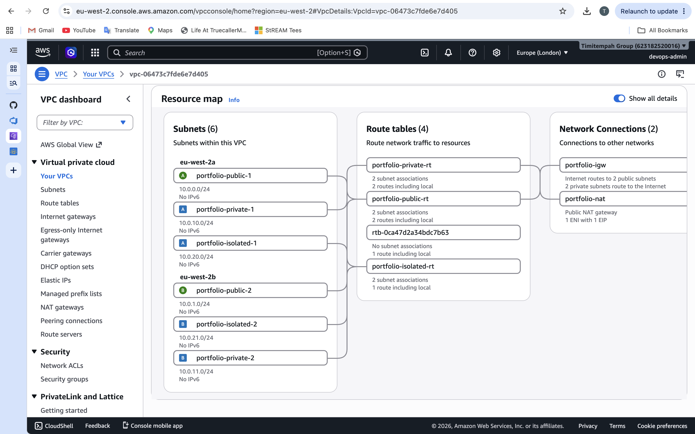

# Task 2 — VPC & Multi-Tier Network Build

## What This Task Covers

A resilient three-tier VPC — public, private, and isolated subnets — spread across two
Availability Zones, built entirely with Terraform. This is the standard architecture
pattern for separating internet-facing components from application logic, and
application logic from data, at the network level rather than relying on access
control alone.

## Architecture

- **Public subnets** (`10.0.0.0/24`, `10.0.1.0/24`): route to an Internet Gateway, intended for internet-facing load balancers and the NAT Gateway
- **Private subnets** (`10.0.10.0/24`, `10.0.11.0/24`): route outbound-only through a NAT Gateway, intended for application servers that need to reach the internet (e.g. for software updates) without being directly reachable from it
- **Isolated subnets** (`10.0.20.0/24`, `10.0.21.0/24`): no route to the internet at all, not even via NAT — intended for databases with no legitimate reason to initiate outbound internet connections

Each tier is duplicated across `eu-west-2a` and `eu-west-2b` for resilience against a single Availability Zone failure.

## Verification

Confirmed via AWS CLI that all 6 subnets exist with the correct AZ and CIDR block:

Critically, confirmed the isolated subnets' route table has only the default local route — no path to an Internet Gateway or NAT Gateway:

This is direct proof the isolated tier is genuinely unreachable from, and cannot reach, the internet — not just access-controlled, but network-isolated.

## Evidence

## Why This Matters

When a client has a compliance requirement stating a database "must not be publicly accessible," a firewall rule alone is a weaker guarantee than genuine network isolation. This design satisfies that requirement literally: the isolated tier has no possible network path to the internet, regardless of any Security Group or IAM policy configuration on top of it.