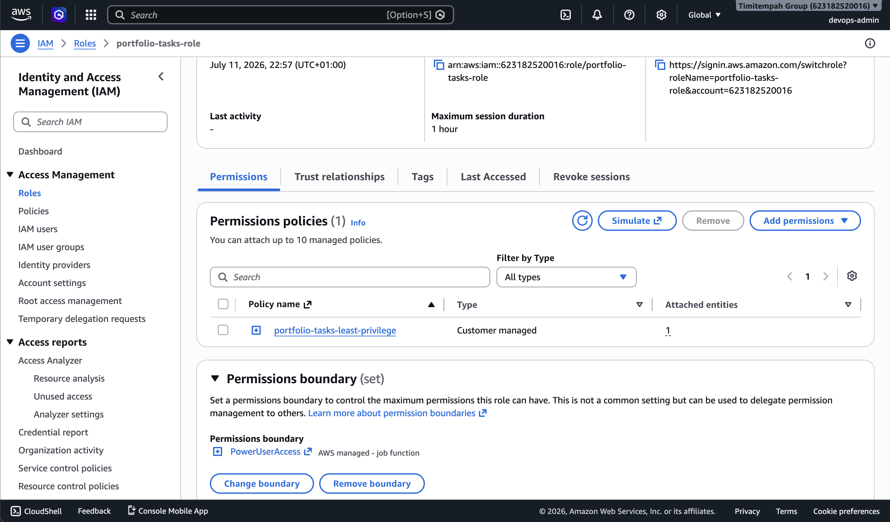
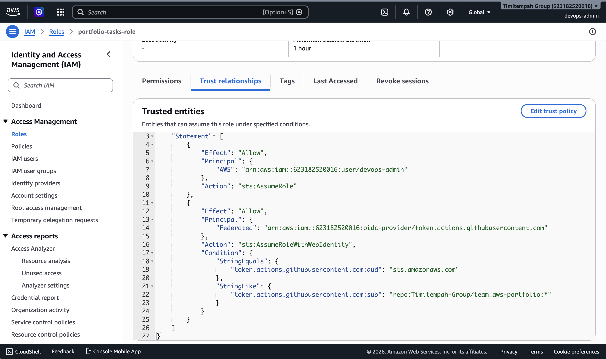

# Task 3 — IAM Least-Privilege & Federated Access

## What This Task Covers

Replacing broad, standing administrative access with a properly scoped IAM Role, and setting up GitHub OIDC federation so future CI/CD pipelines can deploy to AWS without ever storing a long-lived access key.

## What Was Built

**A least-privilege IAM policy** (`portfolio-tasks-least-privilege`) scoped only to the specific services these portfolio tasks actually need — EC2/VPC, S3, and DynamoDB access limited to the Terraform state lock table — rather than granting broad administrative access for convenience.

**A permission boundary** (`PowerUserAccess`) attached to the role, setting a hard ceiling on the maximum permissions it can ever have, regardless of what any future policy attached to it might grant.

**GitHub OIDC federation**, registering GitHub's OIDC provider as a trusted identity source and updating the role's trust policy so GitHub Actions workflows running specifically from the `Timitempah-Group/team_aws-portfolio` repository can assume the role directly — with no AWS access key or secret ever stored in GitHub.

## Verification

Confirmed via `aws sts assume-role` that the role can genuinely be assumed, returning valid temporary credentials scoped to `portfolio-tasks-role`.

Confirmed via the IAM console that:
- The least-privilege policy and permission boundary are both correctly attached
- The trust policy contains both the direct IAM user trust and the GitHub OIDC federation trust, scoped to this specific repository

## Evidence

**Permissions and permission boundary:**

**Trust relationships:**

## Why This Matters

A single, broadly-scoped credential shared across every automated process is a common audit finding — if it ever leaks, the blast radius is the entire account. Scoping this role to only what's needed, capping it with a permission boundary, and removing the need for any stored credential at all (via OIDC) closes that gap before any CI/CD pipeline is even built.