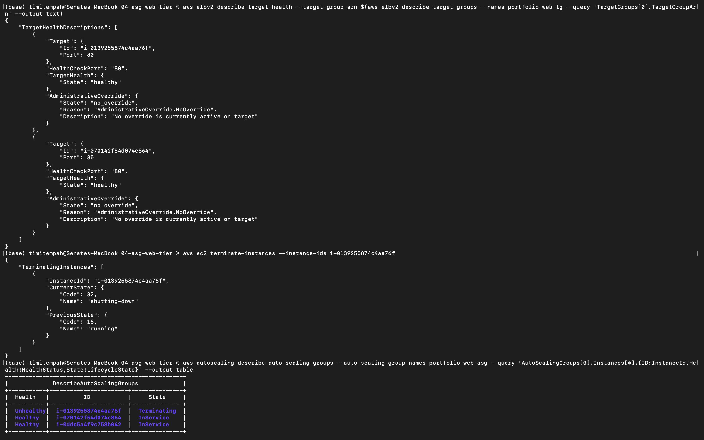
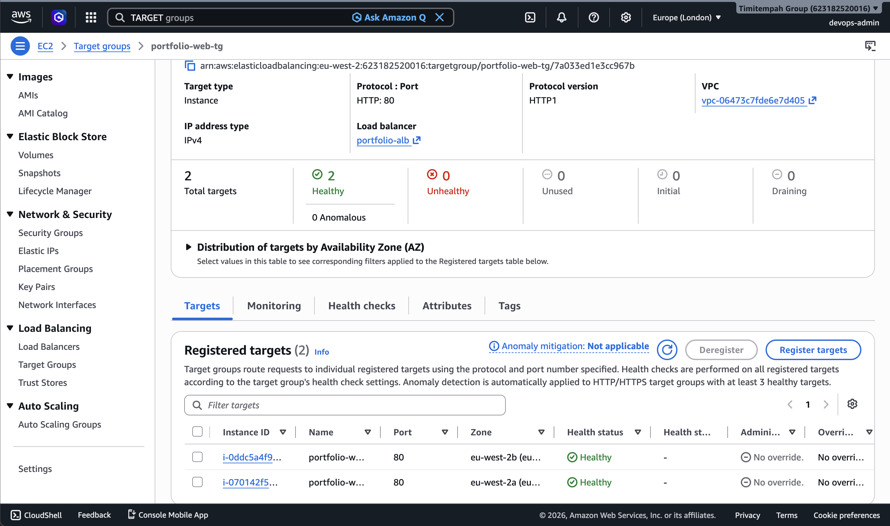
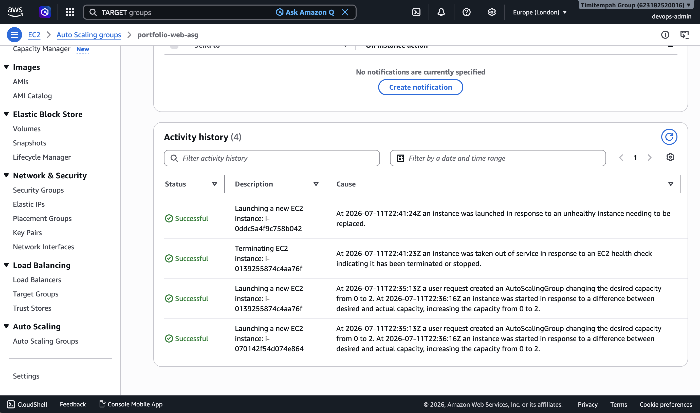

# Task 4 — Auto Scaling Web Tier

## What This Task Covers

A resilient web tier deployed into the VPC from Task 2: an Application Load Balancer in the public subnets, fronting an Auto Scaling Group of web servers in the private subnets, spanning both Availability Zones.

## Architecture

- Web instances sit in the **private** subnets — never directly reachable from the internet, only through the ALB
- The **ALB** sits in the public subnets and is the only internet-facing component
- The Auto Scaling Group uses **ELB health checks**, not just EC2 status checks, so a crashed web server is actually detected and replaced
- Security Groups are layered: the web tier only accepts traffic from the ALB's Security Group, not from anywhere else

## Verification

Confirmed the ALB responds correctly, and manually terminated one running instance to prove the Auto Scaling Group's resilience is real, not just configured. The ASG detected the termination and launched a replacement automatically, maintaining its desired count of 2 throughout.

## Evidence

**Terminal walkthrough — target health check, manual termination, and automatic replacement:**

**Target group showing both instances healthy in the Console:**

**Auto Scaling Group activity history confirming the automatic replacement:**

## Why This Matters

A load balancer and Auto Scaling Group configured correctly on paper is different from one proven to actually recover from a real failure. Manually terminating a live instance and watching the ASG replace it is the difference between claiming resilience and demonstrating it.