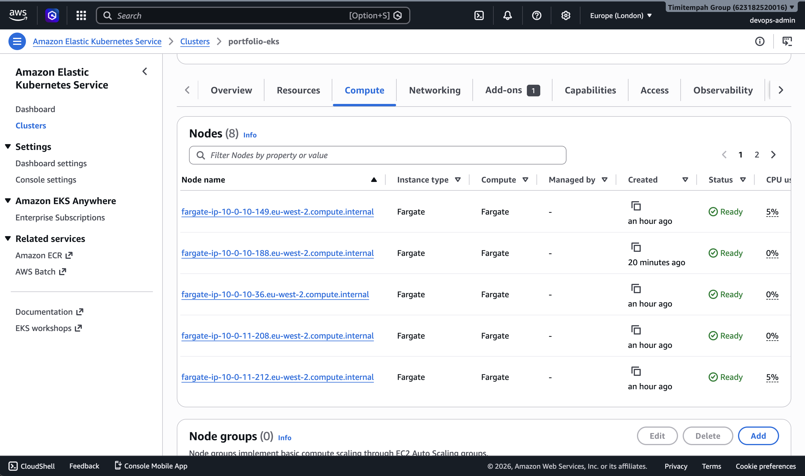
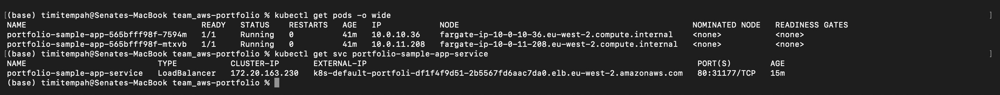

# Task 5 — EKS Production Cluster

## What This Task Covers

An EKS cluster running entirely on Fargate (no self-managed EC2 nodes), with a sample application deployed and exposed to the internet through a Network Load Balancer, proving the cluster genuinely runs real workloads end-to-end.

## Architecture

- **EKS control plane** with a Fargate profile, deployed into the private subnets from Task 2
- **A sample application** (2 replicas) running as Fargate pods, each pod getting its own dedicated compute — visible in the node list as one Fargate node per pod, including system components like CoreDNS
- **AWS Load Balancer Controller** installed via Helm, handling proper integration between Kubernetes Services and AWS load balancers
- **A Network Load Balancer** with IP-based target routing, directly targeting the Fargate pods' IP addresses

## Common Technical Issues & Fixes

**Issue: The default Kubernetes LoadBalancer Service type doesn't work on Fargate.**

Creating a type: LoadBalancer Service without any special configuration provisions a Classic Load Balancer that expects to register EC2 instances as targets. Fargate pods have no backing EC2 instances, so the Classic ELB has no way to route traffic to them — the Service gets an external hostname, but every request times out or gets an empty reply.

**Fix:** Install the AWS Load Balancer Controller and annotate the Service to use a Network Load Balancer with IP-based target routing, which registers pod IP addresses directly as targets instead of expecting EC2 instance IDs.

**Issue: The AWS Load Balancer Controller's official IAM policy was missing a required permission.**

Even after installing the controller correctly, it failed to provision the load balancer with a 403 UnauthorizedOperation error on ec2:DescribeRouteTables — a permission the controller needs to determine which subnets are suitable for the load balancer, but which was missing from the IAM policy JSON at the time it was created.

**Fix:** Re-downloaded the current official IAM policy from the AWS Load Balancer Controller's GitHub repository, added it as a new version of the existing IAM policy (preserving all other required permissions), and restarted the controller to pick up the fix.

## Verification

Confirmed all Fargate nodes are Ready, both application pods are Running, and the Service is correctly provisioned with a working external hostname.

Confirmed the application is genuinely reachable from the public internet — the response correctly identified which specific Fargate pod served the request, proving the full path from internet to pod works, not just that resources exist:

Server address: 10.0.11.208:80
Server name: portfolio-sample-app-565bfff98f-mtxvb

## Evidence

Fargate nodes, all Ready:

Application pods running and Service with working external hostname:

## Why This Matters

Fargate's serverless model removes node management entirely, but it changes how networking integrations behave underneath — a default LoadBalancer Service that works fine on EC2-backed nodes silently fails on Fargate with no obvious error, and even the standard fix (the Load Balancer Controller) can hit an incomplete IAM policy from an external source. Recognising and working through this kind of platform-specific gap, rather than assuming a documented setup will just work, is exactly the kind of troubleshooting a real production EKS deployment demands.
