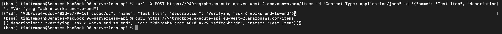
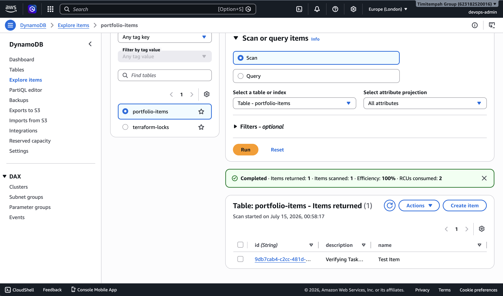

# Task 6 — Serverless API with Lambda

## Summary

A serverless API on AWS's Always Free tier: API Gateway routes requests to Lambda, which reads/writes items in DynamoDB.

- **API Gateway (HTTP API)** — `POST /items`, `GET /items`
- **Lambda (Python)** — single handler, branches on HTTP method
- **DynamoDB** (`portfolio-items`) — stores items by generated UUID
- Lambda's execution role scoped only to the DynamoDB actions and logging it needs

## Issues & Fixes

**API Gateway HTTP APIs send a different event structure than REST APIs.** The method lives at `event['requestContext']['http']['method']`, not `event['httpMethod']`. Fixed by reading the correct nested path.

**A misplaced `code` command created a duplicate file outside the real project path.** Terraform kept deploying the old code since the fix never reached the actual file. Fixed by removing the duplicate and reapplying from the correct folder.

## Verification

POST creates an item and returns it with a generated id. GET returns it back in a list. Confirmed independently in the DynamoDB console.

## Evidence

*POST and GET requests via curl*

*Item confirmed in DynamoDB*

## Why This Matters

API Gateway's HTTP and REST API types look similar but send different payloads to Lambda, failing silently rather than with a clear error. Catching this kind of mismatch is routine work on a real serverless deployment.
