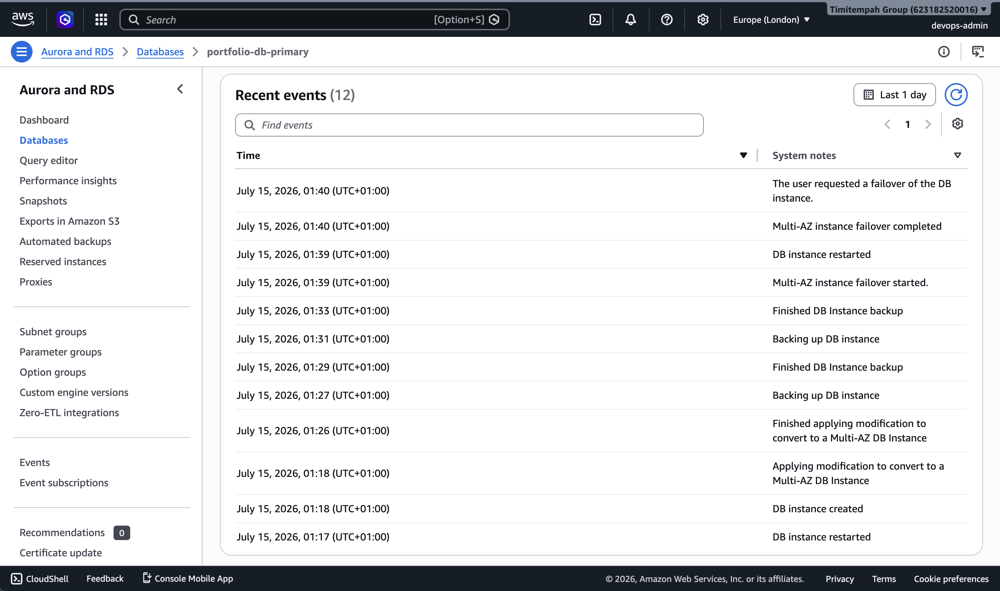
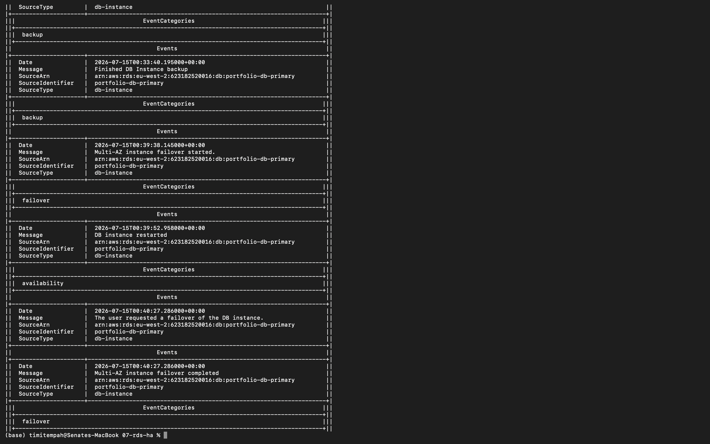

# Task 7 — Highly Available Database Tier

## Summary

An RDS PostgreSQL instance with Multi-AZ enabled for automatic failover, plus a Read Replica for read scaling — deployed into the isolated subnets from Task 2, demonstrating the difference between these two distinct features rather than treating them as interchangeable.

- **Primary instance** (`portfolio-db-primary`) — Multi-AZ enabled, standby in a separate AZ
- **Read Replica** (`portfolio-db-read-replica`) — asynchronous copy for offloading read traffic
- Security Group restricts PostgreSQL access to within the VPC only, no public access
- Deployed into the fully isolated subnet tier, with no route to the internet at all

## Issues & Fixes

**The specified PostgreSQL engine version (16.4) wasn't available in this Region.** AWS periodically deprecates specific patch versions. Fixed by querying `aws rds describe-db-engine-versions` for currently supported versions and using the latest available 16.x release (16.14) instead.

## Verification

Triggered a real Multi-AZ failover using `aws rds reboot-db-instance --force-failover`, then confirmed it genuinely happened via RDS's own event log rather than inferring it from instance state alone:

Multi-AZ instance failover started.
DB instance restarted
The user requested a failover of the DB instance.
Multi-AZ instance failover completed

Separately confirmed the Read Replica is correctly linked and available, with `ReadReplicaSourceDBInstanceIdentifier` pointing at the primary — proving replication is real, not just declared in Terraform.

## Evidence

*Failover sequence in the RDS console*

*Same failover sequence confirmed via the CLI event log*

## Why This Matters

Multi-AZ and Read Replicas solve two different problems and are commonly confused: Multi-AZ answers "what happens if the primary fails," Read Replicas answer "how do we scale reads." Proving the failover actually occurred — via AWS's own event log, not just a status check — is the difference between a resilience feature that's configured and one that's demonstrated to work.

## Database Credentials — Portfolio Simplification

This task sets the database password directly as a plaintext value in the Terraform configuration. That's a deliberate simplification for a self-contained portfolio task, not a pattern used in real client work.

In a real engagement, the password would never be written into source-controlled Terraform at all. Instead: a random password would be generated and stored in AWS Secrets Manager (or pulled from an existing secret), and the RDS resource would reference it via a data source at apply time — so the actual credential never appears in a `.tf` file, a plan output, or Git history. Secrets Manager also handles automatic rotation on a schedule, which a hardcoded value obviously cannot do.