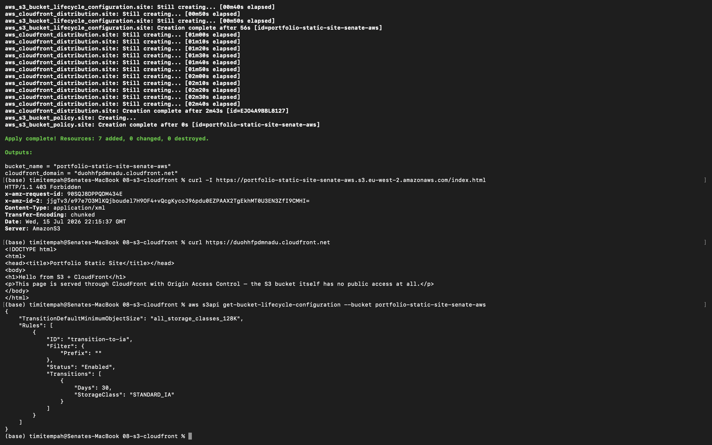

# Task 8 — S3 Data Lifecycle & Static Site via CloudFront

## Summary

A static site hosted on S3 and served through CloudFront using Origin Access Control (OAC), so the bucket itself is never directly reachable — combined with a lifecycle policy demonstrating automated storage class transitions.

- **S3 bucket** — fully private, all public access blocked at the bucket level
- **CloudFront distribution** — the only path to the content, using OAC to authenticate to S3
- **Bucket policy** — explicitly scoped to allow reads only from this specific CloudFront distribution, not from CloudFront generally
- **Lifecycle rule** — transitions objects to Standard-IA after 30 days

## Verification

Confirmed the bucket has no direct public access: requesting the object's S3 URL directly returns `403 Forbidden`.

Confirmed CloudFront correctly serves the same content: requesting the CloudFront domain returns the actual page.

Confirmed the lifecycle rule is live via `aws s3api get-bucket-lifecycle-configuration`, showing the 30-day transition to `STANDARD_IA`.

## Evidence

*Direct S3 access denied (403), CloudFront serving content successfully, and lifecycle policy confirmed — all in one terminal session*

## Why This Matters

A bucket policy alone can still leave a bucket technically public if misconfigured elsewhere; Origin Access Control combined with blocking all public access at the bucket level removes that risk entirely; CloudFront becomes the only possible path to the content, by design rather than by convention. The lifecycle rule is the same low-effort, high-value cost optimisation covered in the handbook — most organisations leave data in the most expensive storage tier indefinitely simply because no one configured a transition rule.
