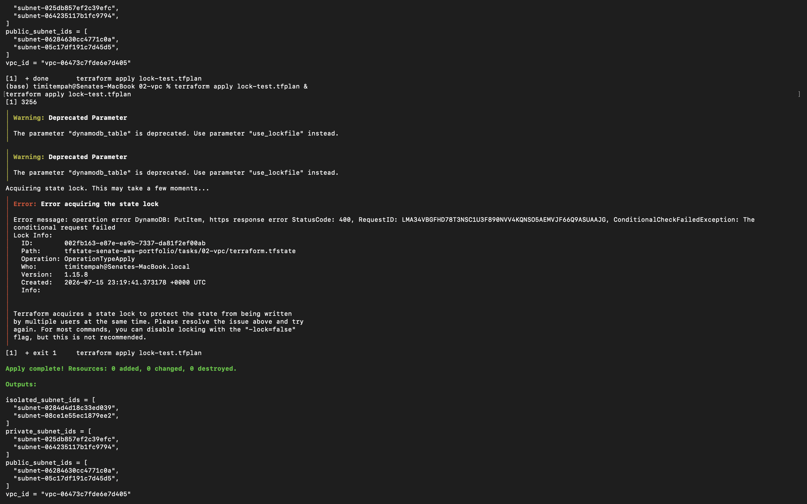
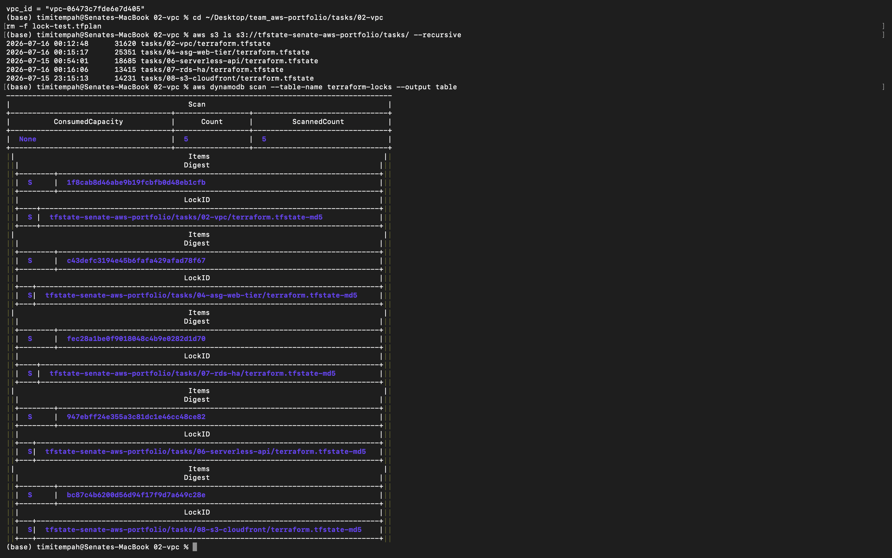

# Task 9 — Terraform IaC Pipeline

## Summary

Refactored the infrastructure from Tasks 2, 4, and 7 into three reusable Terraform modules (`vpc`, `web-tier`, `database`), then migrated the existing state so each task's real, already-deployed infrastructure was recognized under its new module address — nothing was destroyed or recreated in the process.

- **`modules/vpc`** — the three-tier VPC structure from Task 2
- **`modules/web-tier`** — the ALB + Auto Scaling Group from Task 4
- **`modules/database`** — the RDS Multi-AZ + Read Replica setup from Task 7
- Each task's root `main.tf` now simply calls its module, rather than defining resources inline

## Tag Backfill

Tasks 2 and 4 predated the `default_tags` convention adopted after a tagging gap was flagged (see repo Issues). Migrating their state into the new modules also applied the standard tag set (`Project`, `Task`, `Owner`, `Environment`) retroactively, closing that gap as planned rather than leaving it unresolved.

## Verification

**State migration integrity:** used `terraform state mv` to relocate every existing resource into its module address, then ran `terraform plan` in each task. Result: 0 resources to add, 0 to destroy — confirming the refactor didn't touch real infrastructure, only how Terraform organizes and tracks it. The only changes detected were the tag backfill on Tasks 2 and 4.

**State locking, tested for real:** deliberately ran two `terraform apply` operations against the same state file at nearly the same moment. The first acquired the lock and proceeded; the second was explicitly blocked by DynamoDB with a `ConditionalCheckFailedException`, showing the full lock metadata (who holds it, when it was created, which operation). Confirmed afterward that the lock table only retains per-state digest entries, not a stuck lock — proving locks are genuinely temporary, not something that lingers.

## Evidence

*A second, concurrent apply blocked by the state lock, with full lock metadata shown*

*All task state files in S3, and the DynamoDB table showing only per-state digest entries — no active or stuck locks present*

## Why This Matters

A state lock that's merely configured is not the same as one proven to work — the concurrent-apply test is the only way to know for certain that two people (or two pipelines) can't corrupt the same state file by writing to it simultaneously. Refactoring existing, live infrastructure into modules without a single resource being destroyed is also the clearest demonstration that Terraform state can be safely reorganized after the fact, which matters in any real environment where infrastructure was built before a cleaner module structure existed.
