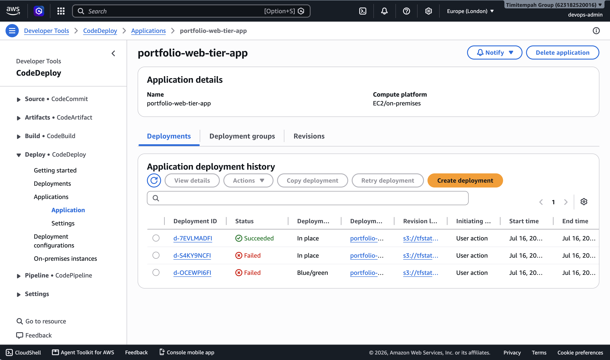
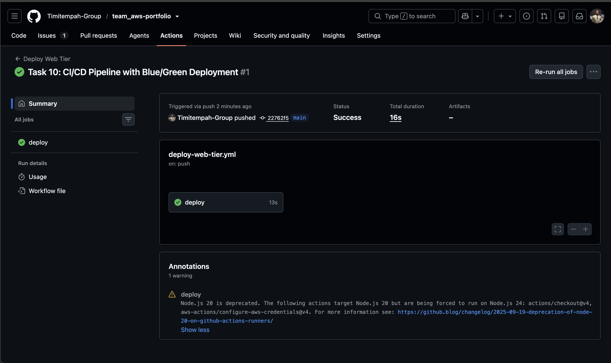
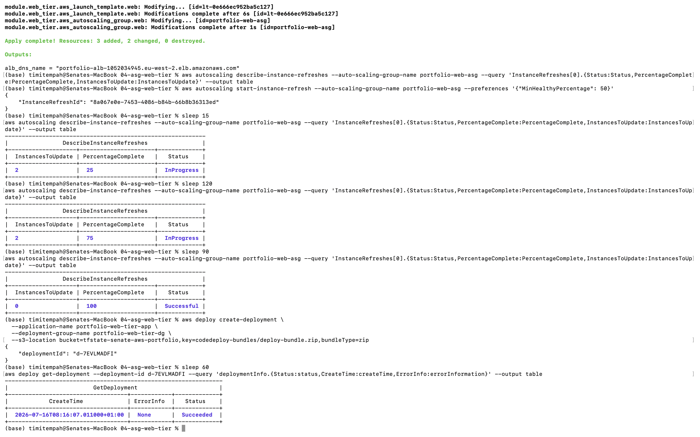

# Task 10 — CI/CD Pipeline with In-Place Deployment

## Summary

A GitHub Actions pipeline that deploys the web tier from Task 4 through AWS CodeDeploy, authenticating entirely via OIDC federation using the Role from Task 3 — no stored AWS credentials in GitHub at any point.

- **GitHub Actions workflow** — triggers on push, authenticates via OIDC, packages and uploads the deployment bundle, triggers CodeDeploy
- **CodeDeploy Application + Deployment Group** — targets the Task 4 Auto Scaling Group directly
- **CodeDeploy agent** — installed via the Launch Template's user-data, required for instances to actually receive deployments

## Issues & Fixes

This task took several genuine iterations to get working, each with a distinct root cause:

**1. Invalid deployment configuration name.** The initial config (`CodeDeployDefault.AllAtOnceBlueGreen`) doesn't exist — blue/green behavior is controlled by a separate `deployment_type` setting, not baked into the config name. Fixed by using `CodeDeployDefault.AllAtOnce` for pacing, with `deployment_type = "BLUE_GREEN"` set separately.

**2. Persistent IAM permission errors on blue/green deployments.** Even after attaching the managed `AWSCodeDeployRole` policy plus a broad custom Auto Scaling/ELB policy, every blue/green deployment attempt failed with the same `IAM_ROLE_PERMISSIONS` error. Verified the permission boundary, trust policy, Auto Scaling service-linked role, and lifecycle hooks were all correct — the error persisted regardless. After multiple systematic checks ruled out every likely IAM cause, the decision was made to pivot to CodeDeploy's `IN_PLACE` deployment type instead of blue/green-with-ASG-copy, which is a well-supported, common alternative specifically because ASG-integrated blue/green has known rough edges in practice.

**3. Deployments failing with `HEALTH_CONSTRAINTS` after the pivot.** Once the IAM issue was sidestepped, deployments failed for a completely different reason: the CodeDeploy agent was never installed on the EC2 instances, since Task 4's original Launch Template only installed the web server. Fixed by updating the Launch Template to install and start the CodeDeploy agent via user-data, adding the required `AmazonEC2RoleforAWSCodeDeploy` instance profile, and triggering a rolling instance refresh so the existing ASG instances were replaced with ones running the updated configuration.

## Verification

The deployment history shows the real progression: two failed attempts (one blue/green, one in-place before the agent fix) followed by a genuine success — visible directly in the CodeDeploy console, not edited out.

Confirmed the GitHub Actions workflow ran successfully end-to-end, authenticating via OIDC with no stored credentials, and confirmed the resulting CodeDeploy deployment succeeded against the live Auto Scaling Group.

## Evidence

*Real deployment history: two failed attempts, then a genuine success*

*The pipeline itself running successfully via OIDC federation*

*Terminal trail of the instance refresh completing, followed by the successful deployment*

## Why This Matters

Blue/green deployment against an Auto Scaling Group is a genuinely fiddly feature in practice, and this task's value isn't that everything worked first time — it's the methodical troubleshooting process: isolating whether an error is IAM, configuration, or infrastructure; knowing when to pivot to a simpler, equally valid approach rather than chasing a dead end indefinitely; and recognising that a new error after a fix is progress, not failure. That process is what a real production CI/CD rollout actually looks like.
