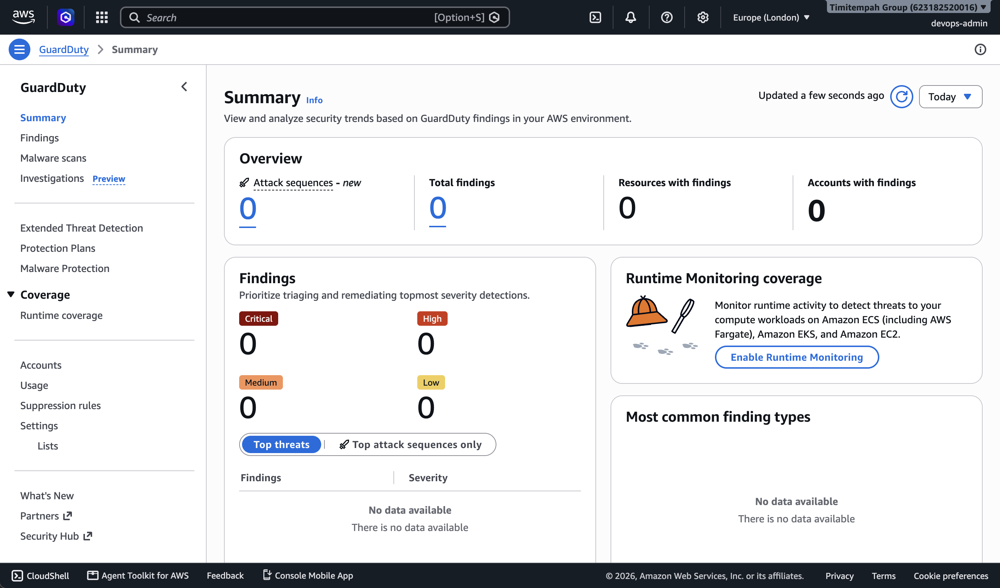
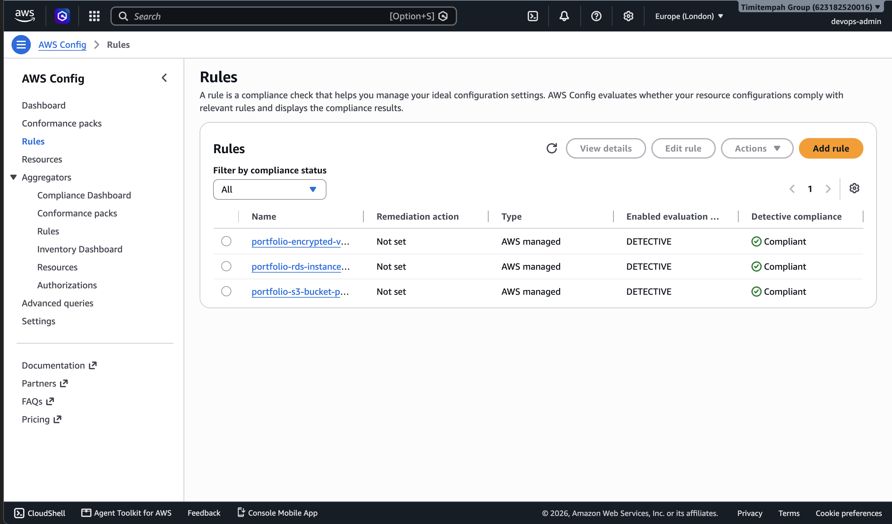
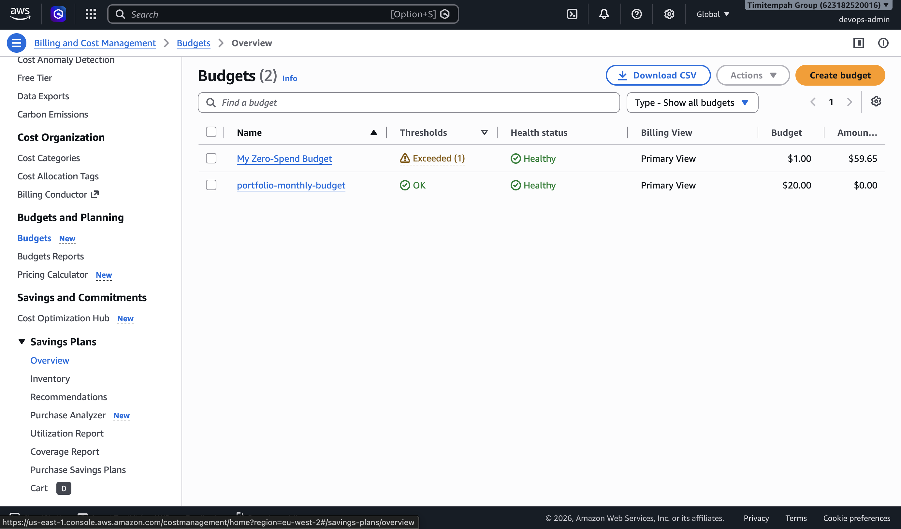
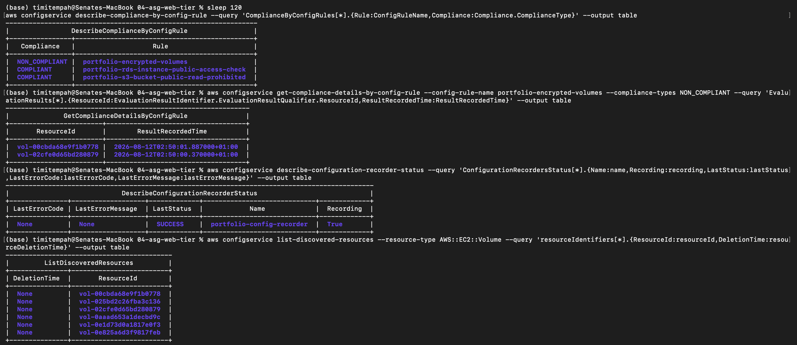
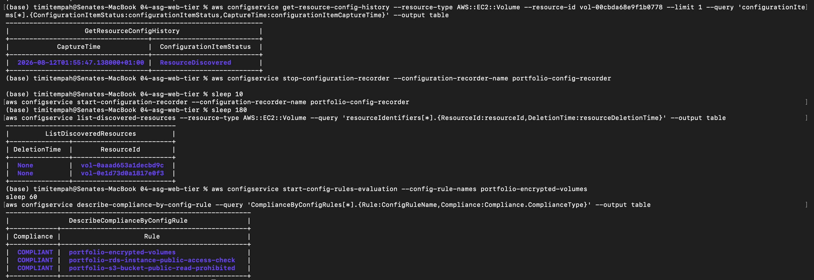

# Task 11 — Security & Cost Governance

## Summary

Three governance layers brought together over everything built in Tasks 1-10: threat detection (GuardDuty), configuration compliance (AWS Config), and cost visibility (Budgets) — closing out the AWS portfolio with the layer that should sit over all the infrastructure, not something bolted on at the end.

- **GuardDuty** — account-wide threat detection, confirmed enabled with S3 and Kubernetes audit log data sources active
- **AWS Config** — three compliance rules covering S3 public access, EBS encryption, and RDS public access, contributed via a separate personal GitHub account and merged through its own Pull Request
- **AWS Budgets** — a monthly budget scoped to the portfolio's cost-allocation tag, with alerts at 80% actual spend and 100% forecasted spend

## A Note on Contribution Split

The AWS Config rules in this task were written, committed, and opened as a Pull Request from a separate personal GitHub identity, on its own branch (feature/config-rules), then reviewed and merged into main. GuardDuty and Budgets were completed directly on main. This split was deliberate: it demonstrates a genuine, reviewable contribution workflow rather than every change landing as a single author's direct commits.

## Issues & Fixes

**A Config rule flagged a real, unencrypted resource.** After enabling portfolio-encrypted-volumes, Config correctly identified that both EBS root volumes on the Task 4/9 web tier's Auto Scaling Group were unencrypted — the Launch Template had never explicitly set encryption on the root volume, so AWS's unencrypted-by-default behavior applied. Fixed by adding an explicit block_device_mappings block with encrypted = true to the Launch Template, and triggering a rolling instance refresh so the ASG replaced the existing instances with encrypted-volume ones. A follow-up sizing error (the corrected volume was initially set smaller than the AMI's own snapshot requires) was caught and fixed the same way.

**AWS Config's compliance cache remained stale even after the fix was deployed and the old volumes were deleted.** describe-compliance-by-config-rule continued reporting the same two, now-deleted volume IDs as non-compliant long after they were confirmed gone via the EC2 API. Manually triggering rule re-evaluation had no effect. Root-caused by checking list-discovered-resources, which showed Config had only ever recorded a single ResourceDiscovered event for each volume and had never processed their deletion — a genuine gap in Config's event-driven resource tracking, not a display or timing issue. Resolved by stopping and restarting the Configuration Recorder itself, which forced a full fresh resource discovery pass; the stale volume references disappeared immediately afterward, and a final rule evaluation correctly returned COMPLIANT across all three rules.

## Verification

Confirmed GuardDuty is enabled with all data sources active via aws guardduty get-detector. Zero findings on the dashboard reflects a clean environment with no detected threats — not an inactive detector, which was independently confirmed via the CLI status check.

Confirmed all three Config rules evaluate as COMPLIANT, following the encryption fix and recorder restart described above.

Confirmed the monthly Budget is correctly scoped and configured with both notification thresholds.

## Evidence

*GuardDuty confirmed active; zero findings reflects a clean account, not an inactive detector*

*Final state: all three compliance rules passing*

*Budget scoped to the portfolio tag with configured thresholds*

*Diagnosing the stale Config compliance cache down to the Configuration Recorder itself*

*Recorder restart resolving the issue, ending in a genuine COMPLIANT result across all rules*

## Why This Matters

Real governance tooling occasionally has real gaps — a compliance tool that never notices a resource was deleted is a legitimate, documented AWS Config behavior, not something a textbook walkthrough usually covers. Diagnosing it down to the Configuration Recorder rather than assuming it was simple lag, and distinguishing "GuardDuty found nothing" from "GuardDuty isn't running," are both the kind of precise, evidence-based reasoning a real security review demands.
